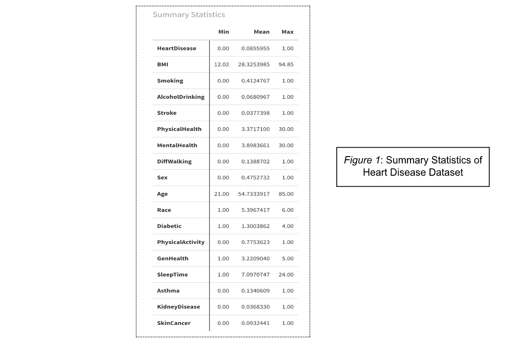

# **Heart Disease Analysis**

According to the CDC, in 2020, Heart Disease was the leading cause of death in the USA for most races. How do we go about tackling this issue as a society? Investigating what the **key correlations** are that have played a role in Heart Disease diagnoses is a good place to start. Once we can understand the factors correlated with Heart Disease, we will be able to determine which preventative measures are needed to minimise future diagnoses by using predictive models that calculate who might be at risk. Through my analysis, I hope to answer:

* What is the impact Age and Sex have on the likelihood of being diagnosed with Heart Disease?  
* Hypothesis: Age plays an influential role in the likelihood of Heart Disease diagnosis but Sex is not an influential factor in the likelihood of Heart Disease.

## **Objectives**

There's unquestionably a lot of factors that can influence someone developing Heart Disease but my goal is to specifically investigate the correlation between one's age, their sex, and the likelihood of being diagnosed with Heart Disease. First, I will wrangle the data set using **tidyverse** to mutate the categorical columns into numerical ones, rename the columns, among other inputs to manipulate my data for investigation. After that, I'll be using the **ggplot2** package to create a variety of Plots & Correlation figures to analyse the relationship of age and sex with heart disease, but also their impact relative to other variables with Heart Disease. I will be using the **DT** and **gt** packages which will create some interactive tables. Because Heart Disease is binary, I decided to conduct a **logistic regression approach**. The logistic regression model will help me determine the relationship between Age/Sex and Heart Disease in my data set. To conduct the missing data handling, I'll be using the **Amelia** package.

## **Data**

The data set I used for this project comes from an annual survey the CDC conducts in the USA with more than 400,000 respondents. A Kaggle user, Kamil Pytlak, took the most relevant factors that are influential in heart disease (whether directly or indirectly) from the original data set and constructed a new condensed data set. The **Indicators of Heart Disease 2020** data set contains 319795 observations of 18 variables. To wrangle this data for the analysis I set out to do, I used tidyverse to rename columns and create different variations of the data set where the values are numeric for correlation analysis, and factors for missing data handling. I also converted the values in the 'Age' column from a range value, to the calculation of the midpoint of the ranges for my analysis (Ex. 55-59 to 57). There was no missing data in this data set so I decided to randomly delete 7% of the data via the **prodNA** function in the **missFOREST** package.

## **Results**

To begin my analysis, I created some exploratory graphs to investigate the relationships between the data. My first Figure is a summary table of the data set to get some initial insight on the structure and the details of each variable. Immediately, you can see the variety of variables that are in this dataset; genetic, health history, and respondents' opinions on their personal health. The data has both categorical and numerical variables. I used **tidyverse** to rename the Age column and change the binary values in the original dataset from “Yes” and “No” to numerical to perform analysis, such as a correlation heatmap. There are also ordinal variables that have an order to their response options (Ex. General Health options are “Poor,Fair,Good,Very Good,Excellent”). The mean’s here give a preliminary idea of the distribution of the responses prior to the graphing. 

To begin my analysis on the relationship age and sex have with the likelihood of being diagnosed with heart disease, I created a variety of graphs using **ggplot2**. *Figure 2* is a faceted histogram plot showing the distributions and relationships age and sex have with the positive heart disease diagnoses. By separating the histograms by sex, I was able to see the difference in the amount of positive heart diagnoses in males and females. We can see that even though male responses make up 47.52% of the survey, more males have heart disease in the data set, exactly 58.97%. Both graphs are strongly skewed to the left, indicating that after about the age of 50 there’s an exponentially large increase in the amount of positive diagnoses of heart disease. I had to take into account the amount of responses from each Age group in the dataset, and that being a potential for bias and the reason for the skew. To investigate this, I used the **prop.table** function to calculate the percentages. The nine categories from ages 18-54 and the 75 and older category, each fall within the 5-7% range of the total number of responses. The four categories from ages 55-74 each fall within the 8-10% range of total number of responses. The latter categories of ages are where we start to see a large jump in counts of heart disease, however the percentage totals aren’t so large that it changes the overarching analysis of the two variables. I did consider that to be a slight bias however in the data, and I kept that in mind for the strength of the graph. Overall, *Figure 2* tells me there’s a strong correlation with age and heart disease in that heart disease is much more prevalent, the older the subjects get.

Due to the Heart Disease variable being binary in my data set, I chose to use a logistic regression approach to investigate the relationship further. By developing a logistic regression model, I am able to determine the impact of my predictor variables, Age and Sex, on the probability or likelihood of Heart Disease. *Figure 3* shows the results of the logistic regression model I generated via the **glm** function. I was able to make the graph interactive with the **gt** package to create a hover effect and the ability to put columns in ascending or descending order when clicking (although this doesn’t work on PDF). The Intercept, \-6.73, is effectively irrelevant here because it is taking the probability that the reference group, Females at the age of 0, will have heart disease. This isn’t useful for my analysis. However the coefficients, both positive, indicate that there are positive odds of having heart disease. According to this model, with every year in age, the chance of getting Heart Disease is 0.07 stronger. The Sex coefficient in this model means that Males have a 0.67 higher log odds if you are keeping the ages constant. The p-values are extremely small and are all far lower than 0.05 indicating high “statistical significance”. This statistical significance does not mean that there is a high probability age and sex are good predictors of likelihood of heart disease nor would it have meant the opposite if the p-value was greater than 0.05. 

To test the performance of the logistic regression model I made, I decided to plot an ROC curve. The middle diagonal line in an ROC curve represents the ‘no-discrimination line’. This essentially means if the line of my model was on the no-discrimination line, the model would be the same as random guessing. The AUC, Area Under the Curve (0.7461), is our probability’s discriminative power meaning the model is indeed better than random guessing (0.5) but it is not a perfect model (1.0). The  blue curve in the plot in *Figure 4* lies above the diagonal line, indicating that our model shows good ability to determine heart disease diagnosis based on the predictor variables, Age and Sex. It’s possible that the model could be improved by adding more relevant predictor variables or by gathering more data from all three variables.

A Correlation heat map is one way to visually understand the strength of the association my variables have with Heart Disease. In *Figure 5*, I decided to code the plot in ascending order in terms of correlation value to heart disease, to easily see the hierarchy of the different variables. Here, Sex has a positive correlation of only 0.02 which indicates there’s very little to no correlation with heart disease. This is intriguing because the logistic regression model indicated there was a considerably positive coefficient with males having a higher probability. Logistic regression models give a deeper understanding of the data, particularly with a categorical variable like Heart Disease. Correlation heat maps simply look into the association of the two variables whereas the logistic regression approach factors in multiple variables to see the relationship between all of them. What’s very interesting is that Age has the highest correlation with Heart Disease out of all the variables, with a moderate 0.23. Age also has a positive correlation with other health-related variables, such as Physical Health and Stroke. This indicates that as one’s age gets higher, the likelihood of their health worsening gets higher. These health indicators, like Stroke, also have a positive correlation with Heart Disease therefore you could conclude that there might be a domino effect at play.

## **MISSING DATA**

This dataset was clean and had no missing data so I had to generate missing data. I chose to use the **prodNA** function in the **missForest** package which randomly introduces missing data in the data set. I chose to make 7% of the data missing for my analysis. In *Figure 6* below, you are able to see a map of the amount of missing data, using the **missmap** function, and where they are located visually.

Once the 7% of missing data was introduced, I used multiple imputation to solve the issue. Through multiple imputation, we can create multiple versions of the “missing-values” dataset and then fill in the missing values by sampling from the predictive distribution that is based on the data that we have available. Through the **Amelia** package, I was able to do my handling of missing data and create five new imputed datasets. To make sure the data was processed and imputed appropriately, I converted the character columns to factors and specified which variables were categorical and ordinal, like GenHealth. After the datasets were imputed, we ran the same logistic regression model we set up earlier, with all five imputed datasets to analyse the results. In *Figure 7*, we can see the results of the logistic regression model being run on each of the five imputations. The coefficients being very close together for Age and Sex indicate the multiple imputation process ran well and the imputations are consistent.  The consistency of these results reinforces the relationship of Age being a good predictor variable and the higher likelihood of heart disease when Sex is male. 

Finally, we used **Rubin’s Rules** to combine the imputed datasets via the **mi.mield** function. This pooling of data sets provides a more accurate way of looking at the data via the five separate imputations. Rubin’s Rules takes into account the variability between my separate imputations and in *Figure 8*, we are able to see the comparison of the confidence intervals between my original dataset and the pooled imputation datasets. In the table, the Age coefficient is positive but lower in the Pooled model than the original, suggesting that the age does impact the likelihood of heart disease but to a smaller effect. The same result is seen with the Sex variable and its level of impact on the likelihood of heart disease. The range is also wider than the original model, indicating there is a higher level of uncertainty. 

## **Limitations**

This dataset is based on the results of a survey meaning we are counting on people to provide correct answers about themselves. Relying on the answers of humans could lead to bias in the data. It is also possible that the way the survey questions were worded to the respondents could have influenced their responses or swayed them to answer in a certain direction. Another limitation is that there could be a variable that is not included in the dataset that influences the way age and sex interact with heart disease, and why there might be a correlation. 

## **Conclusion**

Based on the results and visualisations, we would conclude that Age is indeed an influential factor in the likelihood of heart disease meaning we failed to reject that part of the null hypothesis. The correlation heatmap showed Age as the highest association and the histogram showed an exponential increase but that alone is not sufficient. The biggest indicator was the logistic regression models from both the original and pooled datasets. They indicated a slight difference in the magnitude of the effect of Age but were in agreement that age was indeed influential. However, the impact of Sex on the likelihood is less influential based on the data. The correlation heatmap showed an extremely small association between sex and heart disease, but more importantly both logistic regression models showed that males were more likely to be diagnosed with heart disease. This could be due to logistic regression models being far more nuanced in their analysis rather than simple correlation between two variables. Therefore we reject the latter part of the null hypothesis that says sex is not a factor in the likelihood of heart disease. 

## **Appendix**

### **Code**

\# Load up packages

require(tidyverse)

require(ggplot2)

require(raster)

require(plotly)

require(Amelia)

require(dplyr)

\# Load up dataset

heart\_disease \<- read.csv("/Users/willz/Desktop/Exeter/R/PROJECT/FINAL/heart\_2020\_cleaned.csv")

\# Check for missing values

missing\_data \<- sapply(heart\_disease,function(x)sum(is.na(x)))

print(missing\_data)

\# Convert Yes/No values to numeric 0,1 to do correlation analysis

library(dplyr)

hd \<- heart\_disease

for(nm in names(hd)){

  if(all(is.element(class(hd\[\[nm\]\]), c("character")),  unique(hd\[\[nm\]\] %in% c("Yes", "No")))){

    hd\[\[nm\]\] \= as.integer(hd\[\[nm\]\] \== "Yes")

  }

}

\# Convert Sex column values to 1 and 0 for male and female

hd \<- hd %\>%

  mutate(Sex \= ifelse(Sex \== "Male", 1, 0))

\# Rename AgeColumn & convert to single numerical value, the mean of the range.

hd \<- hd %\>%

  rename(Age="AgeCategory")

library(tidyverse)

\# Because we can't get the mean of "80 and Older" value we do if/else and denote it as 85

\# Define a function to calculate the midpoint of an age range

calculate\_midpoint \<- function(age\_range) {

  age\_split \<- strsplit(age\_range, "-")\[\[1\]\]

  if (length(age\_split) \== 2\) {

    midpoint \<- mean(as.numeric(age\_split))

  } else if (grepl("80", age\_range, ignore.case \= TRUE)) {

    midpoint \<- 80

  } else {

    midpoint \<- NA  \# Handle other cases or missing values

  }

  return(midpoint)

}

\# Update the Age column with numeric values

hd\_new \<- hd %\>%

  mutate(Age \= sapply(hd$Age, calculate\_midpoint))

\# CREATE SUMMARY TABLE FOR hd\_new

library(DT)

summary\_data \<- data.frame(

  Variable \= names(hd\_new),

  Mean \= sapply(hd\_new, mean, na.rm \= TRUE),

  Median \= sapply(hd\_new, median, na.rm \= TRUE),

  StdDev \= sapply(hd\_new, sd, na.rm \= TRUE),

  Min \= sapply(hd\_new, min, na.rm \= TRUE),

  Max \= sapply(hd\_new, max, na.rm \= TRUE)

)

datatable(summary\_data, 

          options \= list(pageLength \= 10), 

          caption \= "Summary Statistics")

\# Create a new dataset where the columns are numerical for analysis

hd\_num \<- hd\_new %\>%

  mutate(Race \= case\_when(

    Race \== "White" \~ "1",

    Race \== "Black" \~ "2",

    Race \== "American Indian/Alaskan Native" \~ "3",

    Race \== "Asian" \~ "4",

    Race \== "Hispanic" \~ "5",

    Race \== "Other" \~ "6",

    TRUE \~ Race  \# Keep other values as they are

  )) %\>%

  mutate(Diabetic \= ifelse(Diabetic \== "Yes", 1, 0)) %\>%

  mutate(GenHealth \= case\_when(

    GenHealth \== "Poor" \~ "1",

    GenHealth \== "Fair" \~ "2",

    GenHealth \== "Good" \~ "3",

    GenHealth \== "Very good" \~ "4",

    GenHealth \== "Excellent" \~ "5",

  ))

\# Create a new dataset where the columns are numerical for analysis

\# Convert specific categorical features to factors

hd\_numerical \<- hd\_new

hd\_numerical$Race \<- as.factor(hd\_numerical$Race)

hd\_numerical$GenHealth \<- as.factor(hd\_numerical$GenHealth)

hd\_numerical$Diabetic \<- as.factor(hd\_numerical$Diabetic)

hd\_numerical$Race \<- as.numeric(hd\_numerical$Race)

hd\_numerical$GenHealth \<- as.numeric(hd\_numerical$GenHealth)

hd\_numerical$Diabetic \<- as.numeric(hd\_numerical$Diabetic)

\# CREATE A LOGISTIC REGRESSION MODEL TO ANALYZE AGE vs HEART DISEASE

\# Load the necessary libraries

library(ggplot2)

library(caret)

hd\_logistic \<- hd\_new

\# Create a logistic regression model for Age vs. Heart Disease

model\_age \<- glm(HeartDisease \~ Age, data \= hd\_logistic, family \= binomial)

\# Summary of the logistic regression model

summary(model\_age)

\# Put the model results in a table

install.packages("broom")

library(broom)

\# Tidy the results

tidy\_results \<- tidy(model\_age)

\# Display the tidy results as a table

print(tidy\_results)

\# Round to two decimal places

summary\_table \<- summary(model\_age)$coefficients

summary\_table\_rounded \<- round(summary\_table, 2\)

\# Print the rounded summary table

print(summary\_table\_rounded)

\# Create a table graphic

install.packages("gt")

library(gt)

tidy\_results %\>%

  gt() %\>%

  fmt\_number(

    columns \= c(estimate, std.error, statistic),

    decimals \= 2

  ) %\>%

  fmt\_scientific(

    columns \= c(p.value),

    decimals \= 2,

    scale\_by \= 1

  )

\# CREATE AN ROC CURVE TO DETERMINE ACCURACY OF LOGISTIC REGRESSION MODEL

\# Install and load the pROC package

install.packages("pROC")

library(pROC)

\# Predict the probabilities using the logistic regression model

predicted\_probabilities \<- predict(model\_age, newdata \= hd\_logistic, type \= "response")

\# Generate the ROC curve

roc\_obj \<- roc(hd\_logistic$HeartDisease, predicted\_probabilities)

\# Plot the ROC curve

plot(roc\_obj, main="ROC Curve for Age x Heart Disease Logistic Regression Model", col="blue", lwd=2)

abline(a=0, b=1, lty=2, col="gray")

\# Calculate the Area under the Curve

auc(roc\_obj)

\# Add the AUC value to the plot

text(0.2, 0.6, paste("AUC \=", round(auc(roc\_obj), 4)))

\# GENERATE A Age vs. HeartDisease Scatter Plot

library(ggplot2)

library(plotly)

\# Assuming hd\_new is your dataframe

\# Convert HeartDisease to factor

hd\_new$HeartDisease \<- as.factor(hd\_new$HeartDisease)

\# Age vs. Heart Disease Histogram

ggplot(hd\_new\[hd\_new$HeartDisease \== '1',\], aes(x \= Age, fill \= HeartDisease)) \+ 

  geom\_histogram(binwidth=5) \+ 

  labs(title \= "Age Distribution of Patients with Heart Disease",

       x \= "Age",

       y \= "Count") \+

  scale\_fill\_manual(name \= "Heart Disease", 

                    values \= c('1' \= "purple"),

                    breaks \= c('1'),

                    labels \= c('Yes')) \+

  theme\_minimal()

\# Create SCATTER PLOT of Age vs. BMI, coloured by HeartDisease

plot \<- ggplot(hd\_new, aes(x \= Age, y \= BMI, color \= HeartDisease)) \+ 

  geom\_point(alpha=0.6, size=3) \+

  labs(title \= "BMI vs. Age by Heart Disease Status",

       x \= "Age",

       y \= "BMI") \+

  scale\_color\_manual(values \= c('0' \= "orange", '1' \= "purple"),

                     labels \= c('0' \= 'No Heart Disease', '1' \= 'Heart Disease')) \+

  theme\_minimal()

plot

\# Create DENSITY plot of Age vs. Heart Disease, coloured by Sex

\# Filter only those with heart disease for color distinction by sex

hd\_heart\_disease \<- hd\_new\[hd\_new$HeartDisease \== 1,\]

\# Plot

ggplot(hd\_new, aes(x \= Age)) \+

  geom\_density(data \= hd\_heart\_disease, aes(fill \= Sex), alpha \= 0.6) \+ 

  geom\_density(data \= hd\_new\[hd\_new$HeartDisease \== 0,\], fill \= 'orange', alpha \= 0.4) \+

  scale\_fill\_manual(values \= c('Male' \= 'blue', 'Female' \= 'pink')) \+

  labs(title \= "Age Density of Patients with and without Heart Disease",

       x \= "Age",

       y \= "Density",

       fill \= "Heart Disease and Sex") \+

  theme\_minimal()

\# Age & Sex vs. Heart Disease HISTOGRAMS

library(gridExtra)

p1 \<- ggplot(hd\_new\[hd\_new$HeartDisease \== '1',\], aes(x \= Age, fill \= HeartDisease)) \+ 

  geom\_histogram(binwidth=5) \+ 

  labs(title \= "Age Distribution of Patients with Heart Disease",

       x \= "Age",

       y \= "Count") \+

  scale\_fill\_manual(name \= "Heart Disease", 

                    values \= c('1' \= "purple"),

                    breaks \= c('1'),

                    labels \= c('Yes')) \+

  theme\_minimal() \+

  theme(plot.title.position \= "plot")

\# Sex vs. Heart Disease Bar Plot

p2 \<- ggplot(hd\_new\[hd\_new$HeartDisease \== '1',\], aes(x \= Sex, fill \= HeartDisease)) \+ 

  geom\_bar() \+ 

  labs(title \= "Sex Distribution of Patients with Heart Disease",

       x \= "Sex",

       y \= "Count") \+

  scale\_fill\_manual(name \= "Heart Disease", 

                    values \= c('1' \= "purple"),

                    breaks \= c('1'),

                    labels \= c('Yes')) \+

  scale\_x\_discrete(labels \= c('0' \= "Female", '1' \= "Male")) \+

  theme\_minimal() \+

  theme(plot.title.position \= "plot")

\# Arrange the plots side by side

grid.arrange(p1, p2, ncol \= 2\)

\# Create a FACETED HISTOGRAM

\# Plotting the data

ggplot(hd\_new, aes(x \= Age, fill \= as.factor(HeartDisease))) \+

  geom\_histogram(position \= "dodge", bins \= 15\) \+

  facet\_grid(Sex \~ HeartDisease, labeller \= labeller(Sex \= c('1' \= "Male", '0' \= "Female"), HeartDisease \= c('0' \= "No Heart Disease", '1' \= "Heart Disease"))) \+

  scale\_fill\_manual(values \= c("\#FF9999", "\#66CCCC"), labels \= c("No Heart Disease", "Heart Disease"), name \= "Heart Disease Status") \+

  labs(title \= "Distribution of Heart Disease by Age and Sex", x \= "Age", y \= "Count") \+

  theme\_minimal()

\# Filter the dataset to only include rows with Heart Disease \= '1' (Yes)

hd\_filtered \<- hd\_new\[hd\_new$HeartDisease \== '1',\]

\# Create a FACETED HISTOGRAM for those with a positive heart diagnosis

ggplot(hd\_filtered, aes(x \= Age, fill \= as.factor(Sex))) \+

  geom\_histogram(bins \= 15\) \+

  facet\_grid(. \~ Sex, labeller \= labeller(Sex \= c('1' \= "Male", '0' \= "Female"))) \+

  scale\_fill\_manual(values \= c("\#FF9999", "\#66CCCC"), labels \= c("Female", "Male"), name \= "Sex") \+

  labs(title \= "Distribution of Positive Heart Disease by Age and Sex", x \= "Age", y \= "Count") \+

  theme\_minimal()

\# Create a SWARM PLOT

ggplot(hd\_new, aes(x \= as.factor(HeartDisease), y \= Age, color \= as.factor(HeartDisease))) \+

  geom\_jitter(position \= position\_jitter(0.2), size \= 2, alpha \= 0.7) \+

  facet\_grid(\~ Sex, labeller \= labeller(Sex \= c('1' \= "Male", '0' \= "Female"))) \+

  scale\_color\_manual(values \= c("\#FF9999", "\#66CCCC"), labels \= c("No Heart Disease", "Heart Disease"), name \= "Heart Disease Status") \+

  labs(title \= "Swarm Plot of Age by Heart Disease and Sex", x \= "Heart Disease Status", y \= "Age") \+

  theme\_minimal()

\# Create BOX PLOT

ggplot(hd\_new, aes(x \= as.factor(HeartDisease), y \= Age, fill \= as.factor(HeartDisease))) \+

  geom\_boxplot(alpha \= 0.7) \+

  facet\_grid(\~ Sex, labeller \= labeller(Sex \= c('1' \= "Male", '0' \= "Female"))) \+

  scale\_fill\_manual(values \= c("\#FF9999", "\#66CCCC"), labels \= c("No Heart Disease", "Heart Disease"), name \= "Heart Disease Status") \+

  labs(title \= "Box Plot of Age by Heart Disease and Sex", x \= "Heart Disease Status", y \= "Age") \+

  theme\_minimal()

\# Create a LOGISTIC REGRESSION MODEL

\# Required Library

library(stats)

\# Fit logistic regression model

logistic\_model \<- glm(HeartDisease \~ Age \+ Sex, data \= hd\_new, family \= "binomial")

\# Summary of the model

summary(logistic\_model)

\# Create a TABLE of the model results

results\_table \<- data.frame(

  Variable \= c("Intercept", "Age", "Sex (Male)"),

  Estimate \= c(-6.73, 0.07, 0.67),

  \`Std. Error\` \= c("3.77e-2", "5.33e-4", "1.33e-2"),

  \`z value\` \= c(-178.47, 122.60, 50.26),

  \`p-value\` \= c("\<2e-16\*\*\*", "\<2e-16\*\*\*", "\<2e-16\*\*\*")

)

\# Print the table

print(results\_table, row.names \= FALSE)

\# Create TABLE for report

library(DT)

table\_data \<- data.frame(

  Variable \= c("Intercept", "Age", "Sex (Male)"),

  Estimate \= c(-6.73, 0.07, 0.67),

  \`Std..Error\` \= c("3.77e-2", "5.33e-4", "1.33e-2"),

  z.value \= c(-178.47, 122.60, 50.26),

  p.value \= c("\<2e-16\*\*\*", "\<2e-16\*\*\*", "\<2e-16\*\*\*")

)

\# Render the table in the Viewer with the desired title

datatable(table\_data, 

          options \= list(pageLength \= 5, autoWidth \= TRUE),

          caption \= "Logistic Regression Model-Age and Sex vs. Heart Disease")

\# CREATE AN ROC CURVE TO DETERMINE ACCURACY OF LOGISTIC REGRESSION MODEL

\# Install and load the pROC package

install.packages("pROC")

library(pROC)

predicted\_probabilities \<- predict(logistic\_model, type \= "response")

\# Generate the ROC curve

roc\_curve \<- roc(hd\_new$HeartDisease, predicted\_probabilities)

plot(roc\_curve, main="ROC Curve \- Age & Sex vs. Heart Disease", col="\#377eb8", lwd=2)

abline(a=0, b=1, col="gray")

\# Calculate the Area under the Curve

auc(roc\_curve)

\# Add the AUC value to the plot

text(0.2, 0.6, paste("AUC \=", round(auc(roc\_obj), 4)))

\# CREATE A CORRELATION HEAT MAP

install.packages("reshape2")

library(reshape2)

\# Define the number of top correlated variables to display

x \<- 18

\# Select variables with the highest correlation with 'HeartDisease'

cols \<- names(sort(cor(hd\_numerical)\[,"HeartDisease"\], decreasing \= TRUE))\[1:x\]

\# Calculate the correlation matrix for the selected variables

cor\_matrix \<- cor(hd\_numerical\[, cols\])

\# Create a long-format data frame for the heatmap

cor\_data \<- melt(cor\_matrix)

\# Set up the plot

plt \<- ggplot(data \= cor\_data, aes(Var2, Var1, fill \= value)) \+

  geom\_tile() \+

  scale\_fill\_gradient2(low \= "blue", high \= "red", limits \= c(-1, 1)) \+

  theme\_minimal() \+

  theme(axis.text.x \= element\_text(angle \= 45, hjust \= 1, vjust \= 1)) \+

  labs(title \= "Correlation Heatmap of Heart Disease Variables", x \= NULL, y \= NULL) \+

  geom\_text(aes(label \= round(value, 2)), vjust \= 1\)  \# Add numeric values

\# Display the heatmap

print(plt)

\# CREATE A CORRELATION TABLE

\# Calculate the correlation of each variable with "HeartDisease"

correlation\_with\_heart\_disease \<- sapply(hd\_numerical, function(var) cor(var, hd\_numerical$HeartDisease))

\# Create a data frame to store the correlation values

correlation\_table \<- data.frame(

  Variable \= names(correlation\_with\_heart\_disease),

  Correlation \= correlation\_with\_heart\_disease

)

\# CREATE A TABLE FROM RESULTS USING DT PACKAGE

\# Calculate the correlation of each variable with "HeartDisease"

correlation\_with\_heart\_disease \<- sapply(hd\_numerical, function(var) cor(var, hd\_numerical$HeartDisease))

\# Create a data frame to store the correlation values

correlation\_table \<- data.frame(

  Variable \= names(correlation\_with\_heart\_disease),

  Correlation \= correlation\_with\_heart\_disease

)

\# Sort the correlation table in ascending order

correlation\_table\_sorted \<- correlation\_table\[order(correlation\_table$Correlation), \]

\# Format the Correlation column with two significant figures

correlation\_table\_sorted$Correlation \<- format(correlation\_table\_sorted$Correlation, nsmall \= 2\)

\# Create a nice table using the DT package with only the Variable and Correlation columns

datatable(correlation\_table\_sorted\[, c("Variable", "Correlation")\], 

          options \= list(pageLength \= 10), 

          caption \= "Correlation with HeartDisease")

\# MISSING DATA

install.packages("missForest")

library(missForest)

\# Make version of original dataset with midpoint Age values for Missing Data handling

\# Update the Age column with numeric values

new\_heart\_disease \<- heart\_disease %\>%

  rename(Age="AgeCategory")

\# Because we can't get the mean of "80 and Older" value we do if/else and denote it as 85

\# Define a function to calculate the midpoint of an age range

calculate\_midpoint \<- function(age\_range) {

  age\_split \<- strsplit(age\_range, "-")\[\[1\]\]

  if (length(age\_split) \== 2\) {

    midpoint \<- mean(as.numeric(age\_split))

  } else if (grepl("80", age\_range, ignore.case \= TRUE)) {

    midpoint \<- 80

  } else {

    midpoint \<- NA  \# Handle other cases or missing values

  }

  return(midpoint)

}

\# Update the Age column with numeric values

new\_heart\_disease \<- new\_heart\_disease %\>%

  mutate(Age \= sapply(hd$Age, calculate\_midpoint))

\# Duplicate the original dataset

missing\_data \<- new\_heart\_disease

\# Introduce missing values (7%)

set.seed(123) \# for reproducibility

missing\_data \<- prodNA(missing\_data, noNA \= 0.07)

\# Create a MAP of the missing data

library(Amelia)

missmap(missing\_data)

\# Convert "GenHealth" to an ordered factor

missing\_data$GenHealth \<- factor(missing\_data$GenHealth, 

                                 levels \= c("Poor", "Fair", "Good", "Very Good"), 

                                 ordered \= TRUE)

\# Specify which variables are categorical and ordinal

categorical\_vars \<- c("HeartDisease", "Smoking", "AlcoholDrinking", "Stroke", "DiffWalking", 

                      "Sex", "Race", "Diabetic", "PhysicalActivity", "Asthma", 

                      "KidneyDisease", "SkinCancer")

ordinal\_vars \<- c("GenHealth")

\# Convert columns to factors

char\_cols \<- sapply(missing\_data, is.character)

missing\_data\[char\_cols\] \<- lapply(missing\_data\[char\_cols\], factor)

levels\_genhealth \<- c("Poor", "Fair", "Good", "Very good", "Excellent") 

missing\_data$GenHealth \<- ordered(missing\_data$GenHealth, levels \= levels\_genhealth)

str(missing\_data)

\# Perform multiple imputation

imputed\_data \<- amelia(missing\_data, m=5, noms=categorical\_vars, ords="GenHealth")

\# Analyze each dataset

library(stats)

\# Function to fit logistic regression model

fit\_model \<- function(data) {

  glm(HeartDisease \~ Age \+ Sex, data \= data, family \= binomial)

}

\# Apply the function to each imputed dataset

model\_list \<- lapply(imputed\_data$imputations, fit\_model)

\# Create a TABLE of the 5 logistic regression models

coefs\_list \<- lapply(model\_list, function(model) {

  c(Age \= coef(model)\["Age"\], Sex \= coef(model)\["SexMale"\])

})

\# Convert list to data frame

df\_coefs \<- as.data.frame(do.call(rbind, coefs\_list))

\# Rename rows for clarity

rownames(df\_coefs) \<- paste0("Model\_", 1:5)

print(df\_coefs)

library(gt)

\# Create a table

data \<- data.frame(

  Imputation \= c("Imputation\_1", "Imputation\_2", "Imputation\_3", "Imputation\_4", "Imputation\_5"),

  Age \= round(c(0.05573960, 0.05612749, 0.05611010, 0.05587260, 0.05641820), 3),

  SexMale \= round(c(0.5958924, 0.5873864, 0.5935380, 0.5911869, 0.5972775), 3\)

)

\# Create table using gt

data %\>%

  gt() %\>%

  tab\_header(

    title \= "Imputed Logistic Regression Coefficients"

  ) %\>%

  cols\_label(

    Imputation \= "Imputation",

    Age \= "Age",

    SexMale \= "Sex"

  )

\# Extracting coefficients

age\_coeffs \<- sapply(model\_list, function(model) coef(model)\["Age"\])

sex\_coeffs \<- sapply(model\_list, function(model) coef(model)\["SexMale"\])

\# Extracting intercepts

intercepts \<- sapply(model\_list, function(model) coef(model)\["(Intercept)"\])

\# Extracting standard deviations for Age and SexMale

std\_dev\_age \<- sapply(model\_list, function(model) {

  summary(model)$coefficients\["Age", "Std. Error"\]

})

std\_dev\_sex \<- sapply(model\_list, function(model) {

  summary(model)$coefficients\["SexMale", "Std. Error"\]

})

\# Constructing the table

results\_table \<- data.frame(

  Imputation \= paste0("Imputation ", 1:5),

  Intercept \= round(intercepts, 3),

  Coef\_Age \= round(age\_coeffs, 3),

  Std\_Dev\_Age \= round(std\_dev\_age, 5),

  Coef\_SexMale \= round(sex\_coeffs, 3),

  Std\_Dev\_SexMale \= round(std\_dev\_sex, 3\)

)

print(results\_table)

 library(gt)

gt\_table \<- results\_table %\>%

  gt() %\>%

  tab\_header(

    title \= "Logistic Regression Models from Multiple Imputations",

    subtitle \= "Coefficients and Standard Deviations"

  ) %\>%

  cols\_label(

    Imputation \= "Imputation",

    Intercept \= "Intercept",

    Coef\_Age \= "Coef (Age)",

    Std\_Dev\_Age \= "Std. Dev (Age)",

    Coef\_SexMale \= "Coef (Sex-Male)",

    Std\_Dev\_SexMale \= "Std. Dev (Sex-Male)"

  ) %\>%

  tab\_options(

    row.striping.include\_table\_body \= TRUE

  )

gt\_table

\# RUBINS RULES

\# Extract coefficients from each model

coefficients\_list \<- lapply(model\_list, coef)

\# Extract standard errors from each model

se\_list \<- lapply(model\_list, function(model) {

  sqrt(diag(vcov(model)))

})

\# Convert the lists to matrices

q \<- do.call(rbind, coefficients\_list)

se \<- do.call(rbind, se\_list)

\# Check the structure and content

str(q)

str(se)

library(Amelia)

\# Using mi.meld to combine the results

pooled\_results \<- mi.meld(q, se)

\# Print the pooled results

print(pooled\_results)

\# For the pooled results

confidence\_level \<- 0.95

z\_value \<- qnorm((1 \+ confidence\_level) / 2\)

\# Confidence Intervals for Pooled Results

lower\_bound\_pooled \<- pooled\_results$q.mi \- z\_value \* pooled\_results$se.mi

upper\_bound\_pooled \<- pooled\_results$q.mi \+ z\_value \* pooled\_results$se.mi

\# For the original logistic regression model

original\_confint \<- confint(logistic\_model)

\# Print the results

print("Pooled Confidence Intervals:")

print(cbind(lower\_bound\_pooled, upper\_bound\_pooled))

print("Original Model Confidence Intervals:")

print(original\_confint)

\# Create a TABLE from original\_confint

library(gt)

\# The data for the table

comparison\_data \<- tribble(

  \~Variable, \~\`Original Lower Bound\`, \~\`Original Upper Bound\`, \~\`Pooled Lower Bound\`, \~\`Pooled Upper Bound\`,

  "(Intercept)", \-6.802, \-6.655, \-6.087, \-5.932,

  "Age", 0.064, 0.066, 0.055, 0.057,

  "Sex (Male)", 0.644, 0.697, 0.566, 0.620

)

\# Constructing the gt table with the title

comparison\_table \<- comparison\_data %\>%

  gt() %\>%

  tab\_header(

    title \= "Comparison of 95% Confidence Intervals: Original vs. Pooled Models"

  )

\# Display the table

comparison\_table

